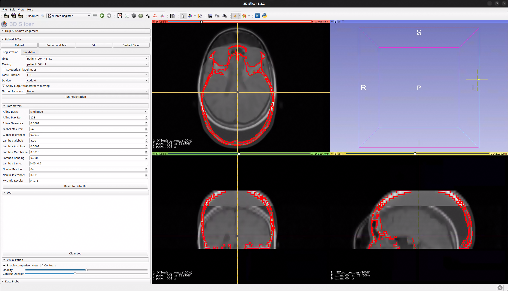

# NITorch Register — 3D Slicer Module

GPU-accelerated affine + nonlinear 3D image registration powered by [NITorch](https://github.com/balbasty/nitorch), directly inside 3D Slicer.



## Prerequisites

- 3D Slicer >= 5.x
- CUDA-capable GPU (optional, for faster registration)

## Installation

### 1. Install Python dependencies in Slicer

Open 3D Slicer's Python console (`View > Python Console`) and run:

```python
pip_install("nitorch")
pip_install("nibabel scipy")
```

If installing nitorch from a local source checkout:

```python
import subprocess, sys
subprocess.check_call([sys.executable, "-m", "pip", "install", "-e", "/path/to/nitorch"])
```

### 2. Add the module path

1. Open 3D Slicer
2. Go to **Edit > Application Settings > Modules**
3. Under **Additional module paths**, click **Add** and browse to:
   ```
   /path/to/nitorch-workstation/slicer_modules/NITorchRegister
   ```
4. Restart 3D Slicer

The module will appear under **Modules > Registration > NITorch Register**.

## Usage

The module has two tabs: **Registration** and **Validation**.

### Registration Tab

1. Load fixed and moving volumes into Slicer
2. Open **NITorch Register** from the Modules menu
3. Select the fixed and moving volumes
4. Check **Categorical** if inputs are label maps (restricts loss to Dice)
5. Choose a loss function (LCC, MSE, NMI, or Dice)
6. Select the computation device (CPU or CUDA; defaults to first CUDA device if available)
7. Click **Run Registration**

The module will run affine + nonlinear (SVF) registration and create a grid transform node. If **Apply output transform to moving** is checked, the transform is automatically applied to the moving volume.

### Output Transform

Each registration run creates a new grid transform named `NITorch_001_lcc_fixed_to_moving` (with incrementing counter and loss name). Use the **Output Transform** selector to switch between previously computed transforms.

### Parameters

The **Parameters** section exposes registration settings. The effective nonlinear regularization for each term is `Lambda Global × Lambda <term>`.

| Parameter | Default | Description |
|---|---|---|
| Affine Basis | similitude | Degrees of freedom (translation, rotation, rigid, similitude, affine) |
| Affine Max Iter | 128 | Max iterations for affine optimizer per pyramid level |
| Affine Tolerance | 0.0001 | Convergence tolerance for affine optimizer |
| Global Max Iter | 64 | Max iterations for interleaved affine/nonlinear optimization |
| Global Tolerance | 0.0010 | Convergence tolerance for outer loop |
| Lambda Global | 5.0 | Global scaling factor multiplied with all individual penalty values |
| Lambda Absolute | 0.0001 | Penalty on absolute displacements (0th order) |
| Lambda Membrane | 0.0010 | Penalty on membrane energy (1st order) |
| Lambda Bending | 0.2000 | Penalty on bending energy (2nd order) |
| Lambda Lame | 0.05, 0.2 | Lame constants for linear elastic energy (two comma-separated values) |
| Nonlin Max Iter | 64 | Max iterations for nonlinear optimizer per pyramid level |
| Nonlin Tolerance | 0.0010 | Convergence tolerance for nonlinear optimizer |
| Pyramid Levels | 0, 1, 2 | Coarse-to-fine pyramid levels (0 = finest) |

### Log

The **Log** section shows real-time registration progress including loss values and iteration counts.

### Visualization

The **Visualization** section provides tools for comparing fixed and moving volumes after registration. Controls are greyed out until both fixed and moving volumes are selected.

- **Enable comparison view** — overlays fixed (background) and moving (foreground) in the slice views with alpha blending. Links slice views and enables the crosshair. Unchecking restores the previous view layout.
- **Contours** — overlays iso-contour edges of the moving image on the fixed image (red outlines)
- **Opacity** slider — controls the blend ratio (0 = fixed only, 100 = moving only)
- **Contour Density** slider — controls the number of iso-contour levels (enabled when Contours is checked)

### Validation Tab

The **Validation** tab computes Dice overlap scores between fixed and moving segmentations:

1. Select a **Fixed** reference volume (typically the fixed image from registration)
2. Select **Fixed Labels** and **Moving Labels** (segmentation nodes)
3. Optionally select an **Output Transform** to evaluate (grid transform from registration)
4. Click **Compute Dice**

The **Summary** table shows the mean Dice (Before and After) for each computed result. Use the **Result** selector to view per-label Dice scores for a specific run. The **Mean Dice** label shows the selected result's mean. Green highlighting indicates improvement, red indicates degradation.

Results accumulate across runs — select different transforms and click Compute Dice again to compare multiple registrations. Use **Clear Results** to reset.

## GPU Support

GPU acceleration requires CUDA to be available in Slicer's Python environment. The Device dropdown automatically detects available CUDA devices. If no CUDA devices appear, registration will run on CPU.

